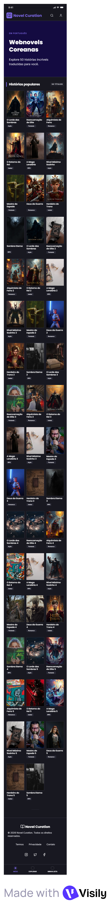

# 01. 인트로 페이지

> 비회원/회원 공통 | `?language=pt` 파라미터 상태에서 접근 시

---

## 목업

| PC | 모바일 |
|----|--------|
|  |  |

> 🖼️ 목업 이미지 추가 필요

---

## 화면 구성

### 01 | 배너 영역
- 포르투갈 서비스임을 인지시키는 상단 배너
- **클릭 시 무반응** (인터랙션 없음)
- 번역 50작 캐릭터 이미지 활용, 소설 사이트임을 직관적으로 표현

| 구분 | 포르투갈어 | 의미 |
|------|-----------|------|
| 타이틀 | Em Português | 포르투갈어 에디션 |
| 메인 문구 | Descubra webnovels coreanos em português | 포르투갈어로 한국 웹소설을 만나보세요 |
| 서브 문구 | Histórias populares que os leitores adoram | 독자들이 사랑하는 인기 이야기들 |

> ※ 문구는 변경될 수 있음

---

### 02 | 작품 텍스트 영역
- 메인 문구 / 서브 문구로 구분

| 구분 | 포르투갈어 | 의미 |
|------|-----------|------|
| 메인 | 🔥 Histórias populares | 인기 있는 이야기 |
| 서브 | Para leitores em português | 포르투갈어 독자를 위해 엄선 |

---

### 03 | 작품 전시 영역

| 항목 | 내용 |
|------|------|
| PC 레이아웃 | 5열 × 10행 = 총 50작품 |
| 모바일 레이아웃 | 3열 × 17행 = 총 50작품 |
| 노출 정보 | 작품 표지, 제목(포르투갈어), 1차 태그(포르투갈어) |
| 작품명 말줄임 | 최대 2줄, 초과 시 `...` 처리 |
| 정렬 기준 | 브라질+포르투갈 회원 기준 조회수 높은 순 |
| 스크롤 방식 | 무한 스크롤 (50작품 고정) |
| 작품 클릭 | `?language=pt` 파라미터 유지한 채 회차리스트로 이동 |

---

### 04 | 푸터 영역
- 글로벌 노벨피아와 공통 푸터 사용

---

## 디자인 요청사항

- [ ] 인트로 페이지 PC 디자인
- [ ] 인트로 페이지 모바일 디자인
- [ ] 배너 이미지 (번역 50작 캐릭터 활용)
- 배너 레퍼런스: https://www.wattpad.com/home
